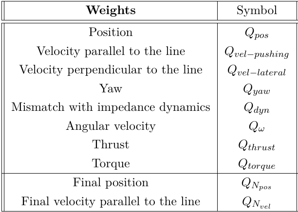

# Basic installation

## RPG Quadrotor Control

For the installation and the usage of the RPG framework got to [UZH-rpg github](https://github.com/uzh-rpg/rpg_quadrotor_control)

## RotorS
Clone the [RotorS](https://gitlab.ethz.ch/dmorra/rotors_simulator/-/tree/cage_offset):
```
git clone -b cage_offset https://gitlab.ethz.ch/dmorra/rotors_simulator.git
```

## Trajectory generator

Clone the [repository](https://gitlab.ethz.ch/dmorra/trajectory_generator.git) selecting the specific branch (push_door):
```
git clone -b push_door https://gitlab.ethz.ch/dmorra/trajectory_generator.git
```

# Usage
After having built (and sourced) the packages, open two terminals. In the first one run:
```
roslaunch mpc general.launch
``` 
In the second terminal run:
```
roslaunch mpc mpc_controller.launch
``` 

## Configuration:
### Simulation set-up
In order to modify the stiffness of the door, go to 
*simulation/flexible_environment/launch/environment.launch* 
and change the **stiffness** and the **damping** parameters.

### MPC basic set-up
You can find the weights of the MPC inside 
*mpc/parameters/default.yaml* 


